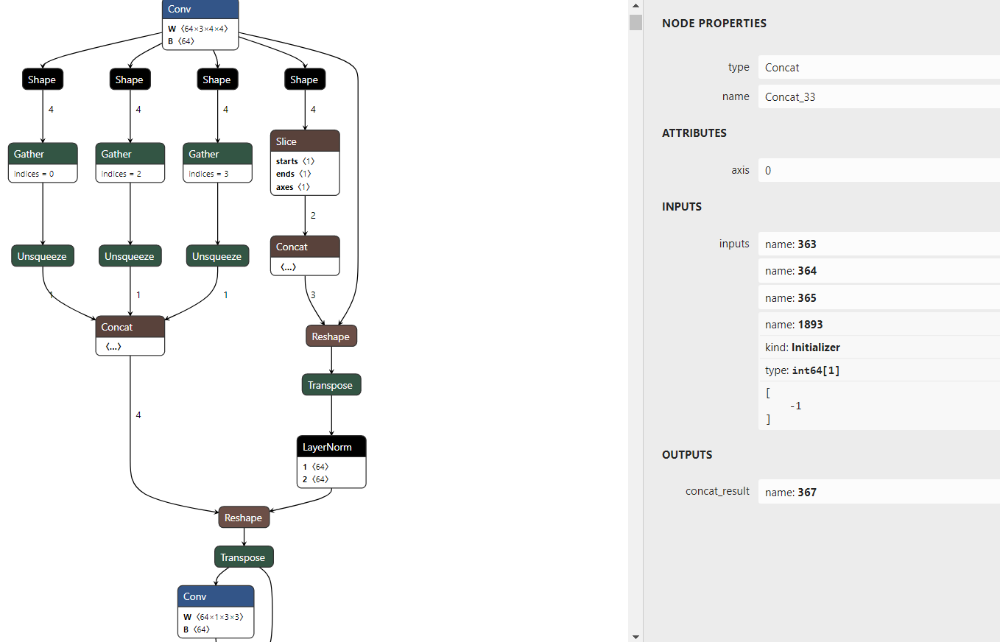

# TensorRT Hackathon 2022

## 总述
---
### 原始模型名称及链接
模型：**UniFormer**(**Uni**fied trans**Former**)

论文：https://arxiv.org/pdf/2201.09450.pdf

代码：https://github.com/Sense-X/UniFormer
### 优化效果

### 运行步骤


## 原始模型
---
### 模型简介
对于图像和视频上的representation learning而言，目前存在两大痛点：
- local redundancy: 视觉数据在局部空间/时间/时空邻域具有相似性，这种局部性质容易引入大量低效的计算。
- global dependency: 要实现准确的识别，需要动态地将不同区域中的目标关联，建模长时依赖。

现有的两大主流模型CNN和ViT，往往只关注解决以上部分问题。Convolution只在局部小邻域聚合上下文，天然地避免了冗余的全局计算，但受限的感受野也难以建模全局依赖。而self-attention通过比较全局相似度，将长距离目标关联，但ViT在浅层编码局部特征十分低效。相较而言，convolution在提取这些浅层特征时，无论是在效果上还是计算量上都具有显著的优势。那么为何不针对网络不同层特征的差异，设计不同的特征学习算子，从而将convolution和self-attention有机地结合起来，各取所长、物尽其用呢？

UniFormer以Transformer的风格，有机地统一convolution和self-attention，发挥二者的优势，同时解决local redundancy和global dependency两大问题，从而实现高效的特征学习。


模型整体框架如上图所示。Uniformer借鉴了CNN的层次化设计，每层包含多个Transformer风格的UniFormer Block。每个UniFormer Block都由三部分组成：动态位置编码DPE、多头关系聚合器MHRA以及前馈层FFN。

### 模型优化的难点

相比于传统的CNN模型（如ResNet50），基于Transformer的模型在控制FLOPS的同时能够取得不错的精度优势。但是，限制一个模型能否商用落地更多的是延迟（Latency）。

| 模型        | 精度    | FP32/FP16推理延迟（倍数关系） | FP32/FP16显存占用 |
|:---------:|:-----:|:-------------------:|:-------------:|
| ResNet50  | 79.1% | 3/1                 | 636MB/579MB   |
| Uniformer | 82.9% | 4.8/3               | 742MB/676MB   |

从上表[1]中可以看到，Uniformer在FP32和FP16下的推理延迟都高于ResNet50，而且Uniformer对量化不友好，FP16的推理延迟只有FP32的62.5%。因此，本次复赛的目标是在保证精度的情况下，基于TensorRT优化Uniformer的推理延迟。

#### 图像分类模型
模型有一个输入和一个输出，输入的维度是(batch, 3, height, width)， 输出的维度是(batch, 1000)。基于onnx模型构建tensorrt egine时，因为输入的height与width是动态的，所以会遇到下面的问题，报错信息是conv算子的group count没有被输入的channel数整除。
```
[06/13/2022-14:53:26] [E] Error[4]: [convolutionNode.cpp::computeOutputExtents::36] Error Code 4: Internal Error (Conv_36: group count must divide input channel count)
[06/13/2022-14:53:26] [E] [TRT] parsers/onnx/ModelImporter.cpp:780: While parsing node number 36 [Conv -> "370"]:
[06/13/2022-14:53:26] [E] [TRT] parsers/onnx/ModelImporter.cpp:781: --- Begin node ---
[06/13/2022-14:53:26] [E] [TRT] parsers/onnx/ModelImporter.cpp:782: input: "369"
input: "blocks1.0.pos_embed.weight"
input: "blocks1.0.pos_embed.bias"
output: "370"
name: "Conv_36"
op_type: "Conv"
attribute {
  name: "dilations"
  ints: 1
  ints: 1
  type: INTS
}
attribute {
  name: "group"
  i: 64
  type: INT
}
attribute {
  name: "kernel_shape"
  ints: 3
  ints: 3
  type: INTS
}
attribute {
  name: "pads"
  ints: 1
  ints: 1
  ints: 1
  ints: 1
  type: INTS
}
attribute {
  name: "strides"
  ints: 1
  ints: 1
  type: INTS
}

[06/13/2022-14:53:26] [E] [TRT] parsers/onnx/ModelImporter.cpp:783: --- End node ---
[06/13/2022-14:53:26] [E] [TRT] parsers/onnx/ModelImporter.cpp:785: ERROR: parsers/onnx/ModelImporter.cpp:166 In function parseGraph:
[6] Invalid Node - Conv_36
[convolutionNode.cpp::computeOutputExtents::36] Error Code 4: Internal Error (Conv_36: group count must divide input channel count)
```

观察onnx计算图可以发现，LayerNorm的输出会被Reshape成一个4维tensor再Transpose(0,3,1,2)后输入给Conv节点，而新的shape是通过Concat得到的。可以看到，图中Concat_33节点的最后一维是-1，经过Transpose后它会被当做channel输入给Conv节点，从而导致上面的错误。

观察LayerNorm节点的操作流程，可知该节点输出的shape是(batch, -1, 64)，而64正好等于Conv节点的group，因此我们可以合理猜测将Conv输入的channel设置为LayerNorm输出的最后一维能够解决此问题。通过下面的代码，我们把Conv节点的输入设置成匹配的值，就可以成功构建tensorrt engine了。
```python
tmap['1893'].values = np.array([64])
tmap['1894'].values = np.array([128])
tmap['1895'].values = np.array([320])
tmap['1944'].values = np.array([512])
```

#### 目标检测模型
目标检测相比于图像分类任务更困难，因此它的模型也更加复杂，这也意味着从pytorch模型转成onnx再构建tensorrt egnine会遇到更多的问题。

在pytorch转onnx过程中，需要注意的一点是checkpoint函数。Uniformre的代码使用了checkpoint来减少训练过程中显存的使用，然而onnx并不支持checkpoint这个op，因此`torch.onnx.export`会调用失败。一种解决方案是在config文件中设置`use_checkpoint=False`，不使用checkpoint相关的算子，这样就能成功导出onnx模型了。
```python
def forward_features(self, x):
    out = []
    x = self.patch_embed1(x)
    x = self.pos_drop(x)
    for i, blk in enumerate(self.blocks1):
        if self.use_checkpoint and i < self.checkpoint_num[0]:
            x = checkpoint.checkpoint(blk, x)
        else:
            x = blk(x)
```

接下来我们要基于onnx模型构建tensorrt engine。因为模型的输入shape为(batch, 3, height, width)，动态的height与width会遇到与图像分类模型相同的问题，可以按照上面的方法解决。除此之外还遇到padding相关的问题。查了相关资料，猜测是tensorrt不支持2D padding，可能的解决方案是把padding op的input给reshape一下。
```
[06/12/2022-14:41:28] [E] Error[4]: [shuffleNode.cpp::symbolicExecute::387] Error Code 4: Internal Error (Reshape_331: IShuffleLayer applied to shape tensor must have 0 or 1 reshape dimensions: dimensions were [-1,2,1])
[06/12/2022-14:41:28] [E] [TRT] parsers/onnx/ModelImporter.cpp:780: While parsing node number 349 [Pad -> "754"]:
[06/12/2022-14:41:28] [E] [TRT] parsers/onnx/ModelImporter.cpp:781: --- Begin node ---
[06/12/2022-14:41:28] [E] [TRT] parsers/onnx/ModelImporter.cpp:782: input: "689"
input: "752"
input: "753"
output: "754"
name: "Pad_342"
op_type: "Pad"
attribute {
  name: "mode"
  s: "constant"
  type: STRING
}

[06/12/2022-14:41:28] [E] [TRT] parsers/onnx/ModelImporter.cpp:783: --- End node ---
[06/12/2022-14:41:28] [E] [TRT] parsers/onnx/ModelImporter.cpp:785: ERROR: parsers/onnx/ModelImporter.cpp:179 In function parseGraph:
[6] Invalid Node - Pad_342
[shuffleNode.cpp::symbolicExecute::387] Error Code 4: Internal Error (Reshape_331: IShuffleLayer applied to shape tensor must have 0 or 1 reshape dimensions: dimensions were [-1,2,1])
```


## 优化过程
---

## 精度与加速效果
---


## References
>[1] https://bbs.huaweicloud.com/blogs/327738
